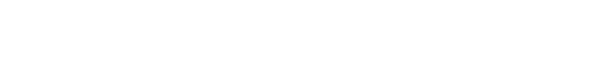

---

 

## Introducción

Este proyecto es un sitio web personal que contiene información sobre mí, mis proyectos, mis habilidades y mi experiencia laboral.

El sitio web está desarrollado con [Astro](https://astro.build/), un marco de trabajo moderno para la creación de sitios web estáticos y dinámicos.

<!-- Puedes acceder al sitio visitando [www.alejoide.com](https://alejoide.com). -->
